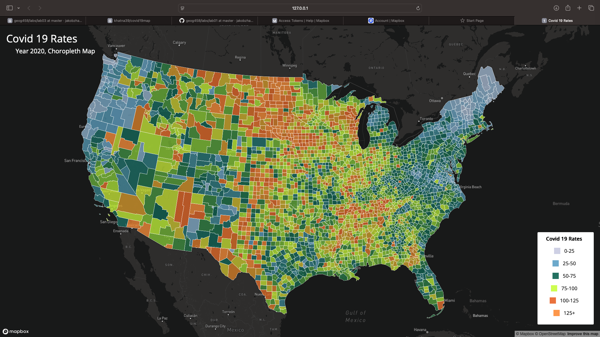
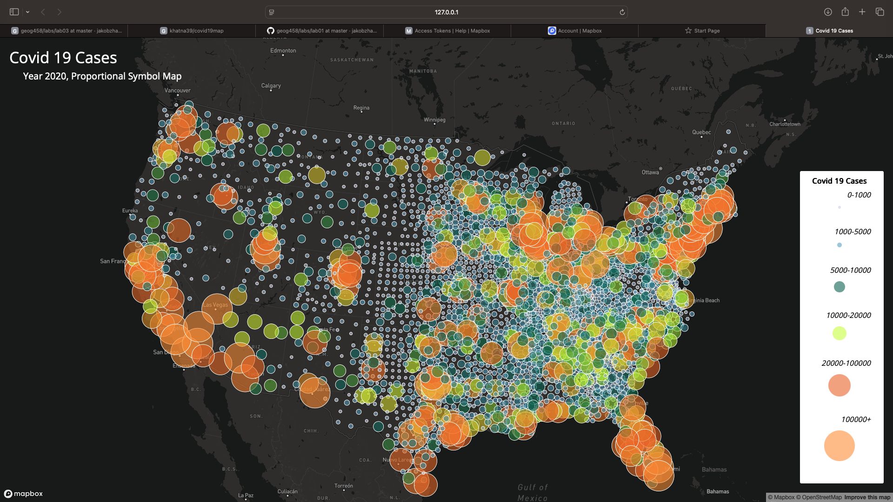

# Khatanbaatar Bayaraa

# Topic: Covid-19 Maps 

The following two maps show the spread of Covid-19 in the US for the year 2020. The choropleth map shows the rates (number of people with covid / population) of all the counties in the US. The proportional symbols map shows the cases (number of people with covid) of all the counties in the US. From the maps, we can observe that the southern states had most of the cases/rates. The cases map also show that large population centers had bigger amount of occurances of Covid-19.

### The Choropleth Map of 2020 Covid-19 Rates in the US

[The link for the Rates map](map1.html)
The data source of this map are The New York Times and 2018 ACS 5-year estimates

### The Proprotional Symbols Map of 2020 Covid-19 Cases in the US

[The link for the Cases map](map2.html)
The data source of this map are The New York Times 

## Methods
The methods used for this project was very similar to the Japan-earthquake project. The difference was, I had to produce 2 maps from 1 main javascript file. To achieve that, I used conditionals and the window object.